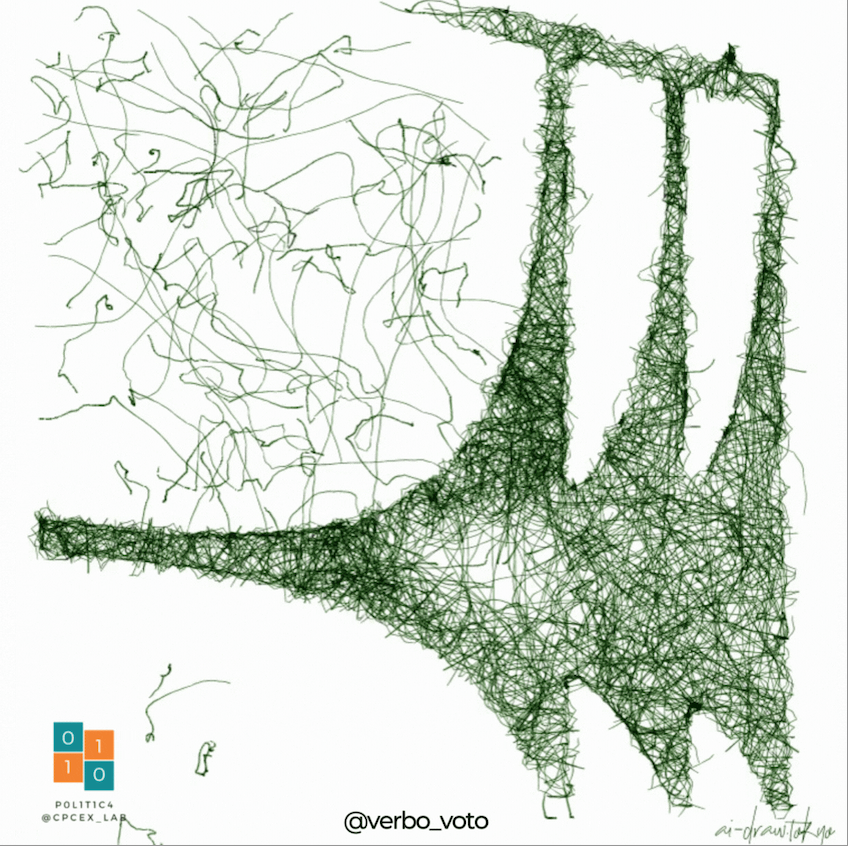

```{r setup, include=FALSE}
library(flexdashboard)
# Install thematic and un-comment for themed static plots (i.e., ggplot2)
# thematic::thematic_rmd()

#devtools::install_github("gaospecial/wordcloud2") com esse pacote todo o resto funcionou!!! Usar essa versão da wordcloud

load("data/disc_pres_prod.RData")
library(tidyverse)
library(quanteda)
library(tidytext)
library(plotly)

pres_tidy <- disc_pres %>%
  unnest_tokens(word, text) %>%
  count(authors_min, word, sort = TRUE)

total_words <- pres_tidy %>% 
  group_by(authors_min) %>% 
  summarize(total = sum(n))

pres_tidy <- left_join(pres_tidy, total_words)

pres_tidy <- pres_tidy %>%
  bind_tf_idf(word, authors_min, n)

```

<style>
p {
  color: #868B8E;
}

h4 {
  color: #1A5653;
}
</style>


Principais termos {data-icon="fa-comments"}
===================================================================

Inputs {.sidebar}
-------------------------------------

<h4>
Nuvem de palavras de termos únicos
</h4>
<br>
<p>As nuvens de palavras dos candidatos a presidência apresenta os termos mais utilizados e únicos pelos candidatos. A análise foi feita através do método de TF-IDF. Para realização das análises foi feita uma parceira com a plataforma [Escriba](https://escriba.aosfatos.org/) através de API desenvolvida por eles</p>

Column {.tabset}
-----------------------------------------------------------------------
```{r, include=FALSE}
ciro_tidy <- pres_tidy %>% 
  filter(authors_min == "ciro") %>% 
  select(word, tf_idf)

lula_tidy <- pres_tidy %>% 
  filter(authors_min == "lula") %>% 
  select(word, tf_idf)

bolsonaro_tidy <- pres_tidy %>% 
  filter(authors_min == "bolsonaro") %>% 
  select(word, tf_idf)

simone_tidy <- pres_tidy %>% 
  filter(authors_min == "simone") %>% 
  select(word, tf_idf)
```


### Ciro Gomes (PDT)

```{r, echo=FALSE, fig.align = 'center'}
#### TIDY (TF IDF)

wordcloud2::wordcloud2(ciro_tidy, widgetsize =c("1200","500"), backgroundColor="#f2f2f2")

```

### Luiz Inácio Lula da Silva (PT)

```{r, echo=FALSE,fig.align = 'center'}
wordcloud2::wordcloud2(lula_tidy, widgetsize =c("1200","500"), backgroundColor="#f2f2f2")
```


### Jair Bolsonaro (PL)


```{r, echo=FALSE,fig.align = 'center'}
wordcloud2::wordcloud2(bolsonaro_tidy,widgetsize =c("1200","500"), backgroundColor="#f2f2f2")
```


### Simone Tebet (MDB)

```{r, echo=FALSE,fig.align = 'center'}
wordcloud2::wordcloud2(simone_tidy,widgetsize =c("1200","500"), backgroundColor="#f2f2f2")

```

Quem menciona quem? {data-icon="fa-users"}
===================================================================

Inputs {.sidebar}
-------------------------------------

<h4> Quem menciona quem?</h4>
<br>
<p>Os gráficos nessa sessão tratam de como os candidatos se mencionam. Duas visualizações são apresentadas, a primeira com o acumulado de menções, a segunda referente ao total de menções por dia.</p>

Column {.tabset}
-----------------------------------------------------------------------

### Menção total 

```{r, echo=FALSE, warning=FALSE, message=FALSE, out.width="20%", out.height="20%"}
library(quanteda.textstats)
library(plotly)
topwords <- toks_pres %>% 
  tokens_keep(pattern = c('lula', 'ciro', 'bolsonaro', 'simone')) %>% 
  dfm() %>% 
  textstat_frequency(groups = authors_min) %>% 
  tibble() 

topwords <- topwords %>% 
  select(group, feature, frequency) %>% 
  left_join(disc_pres, by = c('group' = 'authors_min')) %>% 
  select(group, feature, frequency, author_dur_disc) %>% 
  unique() %>% 
  mutate(freq_dur = frequency / author_dur_disc) %>% 
  rename(source = group,
         target = feature,
         value = freq_dur) %>% 
  filter(source != target)

topwords <- topwords %>% 
  mutate(id_source = case_when(source == "bolsonaro" ~ 0,
                               source == "ciro" ~ 1,
                               source == "lula" ~ 2,
                               source == "simone" ~ 3),
         id_target = case_when(target == "bolsonaro" ~ 4,
                               target == "ciro" ~ 5,
                               target == "lula" ~ 6,
                               target == "simone" ~ 7))

fig <- plot_ly(type = "sankey",
               orientation = "h",
               node = list(label = c("Bolsonaro", "Ciro", "Lula", "Simone", "Bolsonaro", "Ciro", "Lula", "Simone"),
                           color = c("blue", "orange", "red", "darkgreen", "blue", "orange", "red", "darkgreen"),
                           pad = 15,
                           thickness = 20,
                           line = list(color = "black",
                                       width = 0.5)),
               link = list(source = topwords$id_source,
                           target = topwords$id_target,
                           value =  topwords$value))
fig %>% 
  config(displaylogo = FALSE, scrollZoom = TRUE) %>% 
  layout(font = list(size = 15))
```

### Menção por dia

<h4>Menções por dia</h4>

<p>
O gráfico abaixo apresenta o total de menções por dia de um Candidato (Autor) em relação a outro Candidato (Citado). vale ressaltar que não é contabilizada auto citações e o total de citações é calculado pela soma de todas as fontes (entrevista, discurso, propaganda eleitoral, etc) que o candidato participou na data.</p>


```{r, echo=FALSE, warning=FALSE, message=FALSE, fig.align ='right'}
library(lubridate)
library(quanteda)
library(quanteda.textstats)
topwords_date <- toks_pres %>% 
  tokens_keep(pattern = c('lula', 'ciro', 'bolsonaro', 'simone')) %>% 
  dfm() %>% 
  textstat_frequency(groups = interaction(authors_min, date)) %>% 
  tibble() %>% 
  separate(group, c("authors_min", "date"), "\\.") %>% 
  filter(feature != authors_min) %>% 
  mutate(date = ymd(date))

library(crosstalk)
library(plotly)
library(ggplot2)
shared_test <- SharedData$new(topwords_date)

#edicao crosstalk
bscols(widths = c(2,NA), device = "sm",
       list(
         filter_select("authors", "Autores", shared_test, ~authors_min)
       ),
       #edicao ggplot
      plotly::ggplotly(shared_test %>% 
                          ggplot(aes(x = date,y=frequency,
                                     color = feature,
                                     size=frequency,
                                     alpha =frequency,
                                     text =      paste(" Data:", date,"<br>",
                                                       "Autor:", authors_min,"<br>",
                                                       "Citado:", feature, "<br>",
                                                       "Frequência:", frequency, "<br>"
                                                         )
                          )
                          ) + 
                          geom_point() +
                          theme_minimal(base_family = "Calibri", base_size = 14) +
                          labs(color = "Quem foi citado", size= "", alpha= "", y = "Frequência")+
                          theme(panel.grid.major.y = element_blank(),
                                panel.grid.minor.y = element_blank(),
                                plot.subtitle = element_text(face = "italic", size = 13))+
                          scale_x_date(date_breaks = "1 month", date_labels = "%B"),
                        tooltip = c("text")
       ) %>% 
         #plotly
         layout(xaxis = list(rangeslider = list(type = "date")),
                autosize = T) %>%
         config(displaylogo = FALSE) %>%
         config(modeBarButtonsToRemove = c('lasso2d', 'select2d', 'zoom2d'))
      )


```

Sobre {data-icon="fa-home"}
===================================================================

Column
-------------------------------------

<h4>
Olá, este é o Verbo Voto!
</h4>
<br>
<p>No dia 02 de outubro temos as eleições presidenciais. Até lá, os principais candidatos disputam voto a voto com propostas, promessas, debates, postagens em redes sociais e ataques a seus concorrentes em campanha diária. Para retratar a corrida pelo planalto o Laboratório de Ciência Política Computacional e Experimental[(@cpcex_lab)](www.twitter.com/cpcex_lab) lança seu monitor da campanha eleitoral, o Verbo ao Voto. O objetivo do projeto é subsidiar jornalistas, marqueteiros, assessores, os próprios candidatos e a sociedade brasileira com informações sumárias e atualizadas sobre a disputa eleitoral. 
</p>
<p>Com o uso de aprendizagem computacional, estatísticas descritivas e inferenciais, o projeto apresenta informações sumárias e temporais sobre a corrida presidencial. Na versão lançada, mais de 176 horas e 163 falas foram analisadas através do uso do banco de discursos produzido pela plataforma [Escriba](https://escriba.aosfatos.org/).
Mais informações podem ser encontradas em nosso [website](www.verbovoto.netlify.app).
</p>
<h6>Em breve teremos mais atualizações!</h6>

Column
-------------------------------------
```{r, echo=FALSE, fig.align='center'}



```
